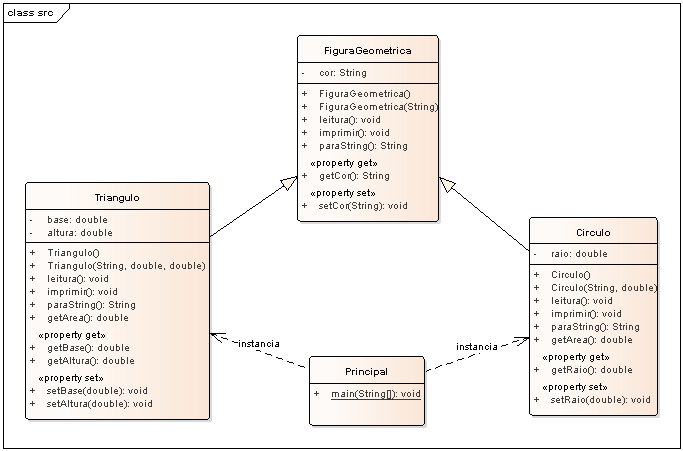

# Exemplo de herança em Java.

## Contextualização

- Exemplo de implementação de herança em Java.
- O projeto modela as classes referentes a objetos geométricos Triangulo e Círculo.
- Figura Geométrica é base para as classes Triângulo e Círculo.
- Triangulo e Circulo são tipos de Figura Geométrica.
- O programa Principal usa objetos da classe Triângulo e Círculo.

## Diagrama de classe

## Arquivos

- pom.xml - Arquivo de configuração da ferramenta de automação Maven.
- *.bat - Arquivos de lote(Batch) de console para tarefas compilar, executar, documentar, empacotar e limpar o projeto.